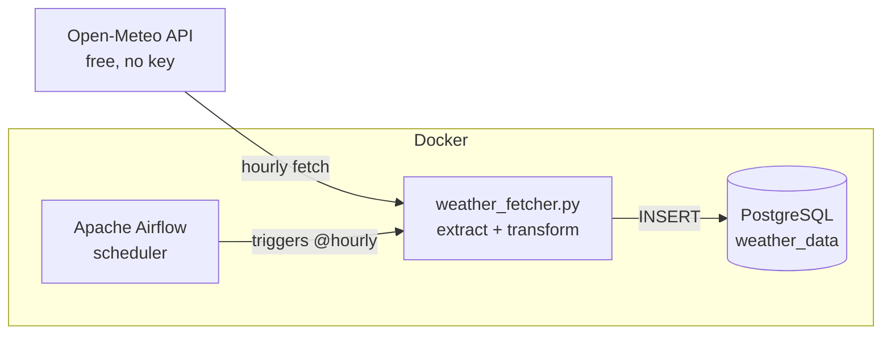

# 🌦️ European Weather Pipeline

An end-to-end **data engineering pipeline** that fetches live weather data for major
European cities, stores it in **PostgreSQL**, and runs on a schedule orchestrated by
**Apache Airflow** — all containerized with **Docker**.

Built as a hands-on demonstration of a production-style ETL workflow: scheduled
ingestion, idempotent loads, environment-based configuration, and reproducible
infrastructure.

---

## 🏗️ Architecture



**Flow:** Airflow triggers the pipeline every hour → the fetcher pulls current
weather for 10 European cities from Open-Meteo → results are transformed and
inserted into PostgreSQL → idempotent inserts prevent duplicates on retries.

---

## 🧰 Tech Stack

| Layer            | Technology                          |
| ---------------- | ----------------------------------- |
| Language         | Python 3                            |
| Data source      | [Open-Meteo API](https://open-meteo.com/) (free, no API key) |
| Storage          | PostgreSQL 15                       |
| Orchestration    | Apache Airflow 2.9                   |
| Containerization | Docker + Docker Compose             |

---

## 📁 Project Structure

```
european-weather-pipeline/
├── dags/
│   └── weather_pipeline_dag.py   # Airflow DAG — schedules the pipeline hourly
├── src/
│   └── weather_fetcher.py        # Core ETL logic (fetch → transform → load)
├── tests/
│   └── test_weather_fetcher.py   # Unit tests (mock API + DB)
├── scripts/
│   └── init_db.sql               # Creates the weather_data DB + table on first boot
├── Dockerfile                    # Custom Airflow image with Python deps baked in
├── docker-compose.yml            # Defines Postgres + Airflow services
├── requirements.txt              # Python dependencies
├── requirements-dev.txt          # Test/dev dependencies
└── .env.example                  # Template for environment variables
```

---

## 🚀 Getting Started

### Prerequisites
- [Docker](https://docs.docker.com/get-docker/) and Docker Compose installed and running.

### 1. Clone and configure
```bash
git clone https://github.com/<your-username>/european-weather-pipeline.git
cd european-weather-pipeline
cp .env.example .env          # then edit .env if you want non-default credentials
```

### 2. Launch the stack
```bash
docker-compose up --build -d
```
This builds the custom Airflow image, starts PostgreSQL, and launches Airflow.
The first build downloads the Airflow image (~1 GB), so give it a few minutes.

### 3. Open the Airflow UI
Visit **http://localhost:8080** and log in:

| Username | Password |
| -------- | -------- |
| `admin`  | `admin`  |

Enable the **`european_weather_pipeline`** DAG (toggle it on). It will run on the
next hour, or you can trigger it manually with the ▶️ button.

### 4. Inspect the data
```bash
docker exec -it weather_postgres psql -U airflow -d weather_data \
  -c "SELECT city, temperature_c, wind_speed_kmh, recorded_at FROM weather_readings ORDER BY recorded_at DESC LIMIT 10;"
```

---

## 🗄️ Data Model

Table: **`weather_readings`**

| Column           | Type           | Description                          |
| ---------------- | -------------- | ------------------------------------ |
| `id`             | SERIAL (PK)    | Auto-incrementing primary key        |
| `city`           | VARCHAR(100)   | City name                            |
| `latitude`       | NUMERIC(7,4)   | Latitude                             |
| `longitude`      | NUMERIC(7,4)   | Longitude                            |
| `recorded_at`    | TIMESTAMP      | UTC time of the reading (from API)   |
| `temperature_c`  | NUMERIC(5,2)   | Temperature in °C                    |
| `wind_speed_kmh` | NUMERIC(6,2)   | Wind speed in km/h                   |
| `created_at`     | TIMESTAMP      | Row insertion time (default `NOW()`) |

---

## 🧪 Running the Tests

Unit tests mock the API and database, so they run instantly — no internet or
PostgreSQL required.

```bash
python -m venv .venv && source .venv/bin/activate
pip install -r requirements.txt -r requirements-dev.txt
pytest -v
```

---

## 🧠 Design Decisions

- **Logic separated from orchestration** — all ETL lives in `src/weather_fetcher.py`;
  the DAG is thin scheduling glue. This keeps the core logic testable on its own.
- **Idempotent loads** — `ON CONFLICT DO NOTHING` means Airflow retries never create
  duplicate rows.
- **Environment-based config** — database credentials come from environment variables,
  so the same code runs locally and in Docker without changes.
- **Reproducible image** — Python deps are baked into a custom Docker image (not
  installed at startup), so builds are fast and deterministic.

---

## 🛣️ Possible Extensions

- Add a transformation/aggregation DAG (daily min/max/avg per city).
- Add data-quality checks (e.g. Great Expectations) as a downstream task.
- Visualize the data with a Grafana or Metabase dashboard.
- Switch to the `CeleryExecutor` for distributed task execution.

---

## 📄 License

MIT — feel free to use this as a learning reference.
